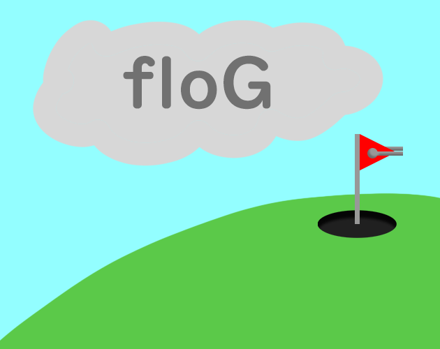

This is my submission for the 2023 GMTK Game Jam, the theme was: "Roles Reversed". This was done completely solo, so it is all my own work, apart from some of the art, sounds and fonts (see below).

I decided to take on the theme with a golf game. In this game, you play as the golf hole trying to avoid golf balls that are trying to roll into you. 

This is my first full project using Unity, and I learnt a ton (above all that I'm definitely not an artist) even if I am slightly disappointed with the result. 

## Art 
All art was done by myself apart from: 
- Heart: https://game-icons.net/1x1/skoll/hearts.html ([CC BY 3.0](https://creativecommons.org/licenses/by/3.0/)) - made heart red + removed black background
- Game Icon: https://game-icons.net/1x1/delapouite/golf-flag.html ([CC BY 3.0](https://creativecommons.org/licenses/by/3.0/))

## Audio
- Golf Ball spawn sound: https://freesound.org/people/CGEffex/sounds/98334/ ([CC BY 4.0](https://creativecommons.org/licenses/by/4.0/))
- Golf in hole sound: https://freesound.org/people/pfranzen/sounds/512505/ ([CC0 1.0](https://creativecommons.org/publicdomain/zero/1.0/))
- Turret fire sound: https://freesound.org/people/Jarusca/sounds/521377/ ([CC0 1.0](https://creativecommons.org/publicdomain/zero/1.0/))
- Turret reload sound: https://freesound.org/people/Dacmod1/sounds/688866/ ([CC0 1.0](https://creativecommons.org/publicdomain/zero/1.0/))
- Heal sound: https://freesound.org/people/shyguy014/sounds/458533/ ([CC0 1.0](https://creativecommons.org/publicdomain/zero/1.0/))
- Main menu ambience: https://freesound.org/people/GeorgeHopkins/sounds/537200/ ([CC BY 4.0](https://creativecommons.org/licenses/by/4.0/))
- Button clicking: https://freesound.org/people/earth_cord/sounds/635915/ ([CC0 1.0](https://creativecommons.org/publicdomain/zero/1.0/))
- Game over: ([CC BY 3.0](https://creativecommons.org/licenses/by/3.0/))

## Music
All music appears in the main game loop of the game and was retrieved from the [Free Music Archive](https://freemusicarchive.org/home)
- Koord - Wolf Asylum - https://freemusicarchive.org/music/Wolf_Asylum/Dogflower/Wolf_Asylum_-_Dogflower_-EP-_-_03_Koord/ ([CC BY-NC-ND 4.0](https://creativecommons.org/licenses/by-nc-nd/4.0/))
- that slowmotion montage where we fall in love - human gazpacho - https://freemusicarchive.org/music/human-gazpacho/single/that-slowmotion-montage-where-we-fall-in-love/ ([CC BY-NC 4.0](https://creativecommons.org/licenses/by-nc/4.0/))
- creamy tomato - human gazpacho - https://freemusicarchive.org/music/human-gazpacho/single/creamy-tomato/ ([CC BY-NC 4.0](https://creativecommons.org/licenses/by-nc/4.0/))

## Fonts
Default Unity Font (Liberation Sans)

[itch.io Page](https://jenboc.itch.io/flog)